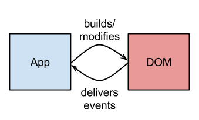
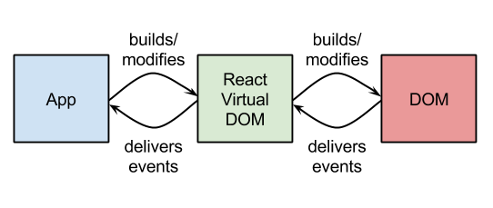
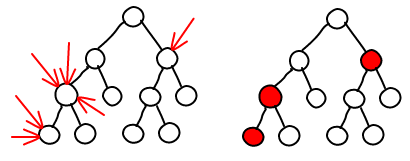
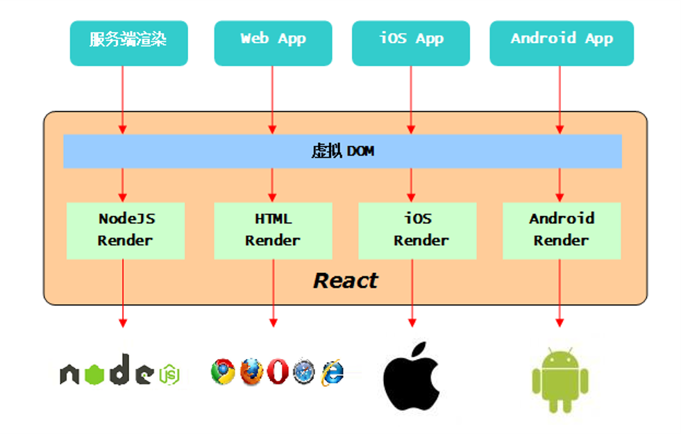

# React 第一天

## 一、建设高性能网站

### 1.1 高性能网站

减少HTTP连接请求

把部分内容压缩

避免CSS表达式

减少DNS查找

避免重定向连接

==避免大量DOM操作==

... ...

### 1.2 性能瓶颈之DOM操作开销

对DOM操作的代价是高昂的，这在网页应用中的通常是一个性能瓶颈。

在《高性能JavaScript》中这么比喻：“把DOM看成一个岛屿，把JavaScript(ECMAScript)看成另一个岛屿，两者之间以一座收费桥连接”。所以每次访问DOM都会

交一个过桥费，而访问的次数越多，交的费用也就越多。所以一般建议==尽量减少过桥次数==。

### 1.3 减少DOM操作

对DOM元素的增删改查会造成页面的==重绘 Repaint==和==重排 Reflow==，循环对DOM操作更是罪恶的行为。所以合理的使用JavaScript变量储存内容，在循环结束时一次性写入。

减少对DOM元素的查询和修改，查询时可将其赋值给局部变量。

### 1.4 来自React的革命性的创新

由于React的设计思想极其独特，性能出众，代码逻辑非常简单。被越来越多的人关注和使用，认为它将是未来Web开发的主流工具。

特点：

​	 ==高效==：React通过对DOM的模拟，最大限度地减少与DOM的交互

​	 ==组件化==：React采取组件化开发，极大限度的使组件得到复用，便于开发管理与维护

​	==适用多端==：一处开发，多端适用，将颠覆整个互联网行业

### 1.5 Virtial DOm -- 虚拟DOM

传统的web应用，操作DOM一般是直接更新操作的，但是我们知道DOM更新通常是比较昂贵的。而React为了尽可能减少对DOM的操作，提供了一种不同的而又强大的方式来更新DOM，避免直接操作DOM。就是Virtual DOM。一个轻量级的虚拟的DOM，就是React抽象出来的一个对象，用来描述DOM应该什么样子的，应该如何呈现。通过这个Virtual DOM去更新管理真实的DOM。


注：虚拟DOM有的人也翻译成react元素

### 1.6 虚拟DOM的实现原理

传统开发中，当app内部状态改变时，会直接修改DOM，造成一定的操作开销，如果同时触发多个事件，事件就会不停的对DOM操作，而产生开销膨胀。





在React中，对虚拟DOM的操作, 不会立刻映射到真实DOM上，这使得React能够等待，直至事件循环结束, 在此之前完全不用操作真实的DOM。React会计算出虚拟DOM的变化（ diff ），并以尽少的操作将diff作用到真实的DOM上。批量DOM操作以及虚拟DOM的变化检测将由React处理完成。

### 1.7 虚拟DOM的变化检测



当修改虚拟DOM时候，React会将修改的虚拟DOM节点标记为修改过（ dirty ）,在事件循环结束时，会对所有修改过的虚拟DOM节点进行处理，并映射到真实DOM

### 1.8 虚拟DOM例子

例如，在DOM处在左侧状态时，我们操作应用程序，为每一个容器设置内容，那么当虚拟DOM检测改变后不会重新创建9个容器，也不会将原来9个容器删除，因为这样开销很大，React会对比左右两种状态，发现只有容器内容发生变化了，因此它会将新的内容设置在9个容器中，减少其他操作，提高性能。


### 1.9 为什么要组件化开发

无论是前端还是后端，在产品确定情况下优化成本有两个途径：==减少部署成本，提高开发效率==。

​	 减少部署成本方面，我们可以将产品迁移到开源的易替换的产品集群等，优化方式有很多。

​	 但对于我们前端来说提高开发效率才是最主要的优化途径。

​			 提高开发效率这方面，主要途径有两点：==加快开发速度，减少变更代价==。

如何提高开发速度？

​	 我们在开发中不要重造轮子，如果可以利用已有的产品，那么开发效率将极大提高。

如何减少变更代价？

​	 如果我们能够理清模块之间的关系，合理分层，每次变更只需要修改其中某个部分。如果不用修改代码，仅仅改变配置就可以，岂不是更好了


### 1.10 多选适配

多端适配：一处开发，多端适用，将颠覆整个互联网行业。为了实现多端适配的混合开发，React将拆分成两类库：一类是核心库：react。一类是渲染库：浏览器端使用react-dom



## 二、React

### 2.1 获取React

Git地址

​	 https://github.com/facebook/react

获取React

​	 npm install react react-dom

​			 注：在ES5开发中，可以通过bower获取react.js和react-dom.js文件

​	 我们使用最新版本，只能使用ES6开发


### 2.2 创建虚拟DOM

#### 	2.2.1 webpack 配置

```js
// 定义接口
module.exports = {
    // 配置开发环境
    mode: 'development',
    // 入口文件
    entry: {
        '01': './modules/01.js',
        '02': './modules/02.js',
        '03': './modules/03.js',
        '04': './modules/04.js',
        '05': './modules/05.js',
        '06': './modules/06.js',
        '07': './modules/07.js',
        '08': './modules/08.js',
        '09': './modules/09.js',
        '10': './modules/10.js',
    },
    // 出口配置
    output: {
        filename: './[name].js'
    },
    // 配置加载机
    module: {
        // 定义规则
        rules: [
            // 配置 js 和 jsx
            {
                test: /\.(js|jsx)$/,
                loader: 'babel-loader',
                // 排除目录
                exclude: /node_modules/,
                // 编译器
                options: {
                    presets: ['@babel/env', '@babel/react']
                }
            },
            // 配置 css
            {
                test: /\.css$/,
                loader: 'style-loader!css-loader'
            },
            // 配置 less 
            {
                test: /\.less$/,
                loader: 'style-loader!css-loader!less-loader'
            }
        ]
    }
}
```


- 核心库：react提供了`createElement`方法用来创建虚拟DOM

  ​	 第一个参数表示虚拟DOM名称（也可以是组件名称）

  ​	 第二个参数表示虚拟DOM的属性对象

  ​	 从第三个参数开始，表示子虚拟DOM

### 2.3 虚拟DOM

- 虚拟DOM是一个普通的JS对象，存储一些必要属性来描述DOM。

  ​	 type 表示虚拟DOM类型

  ​	 key 表示虚拟DOM的id

  ​	 ref  表示对真实DOM的引用

  ​	 props 表示虚拟DOM中所有属性对象

  ​			  children 表示虚拟DOM的子虚拟DOM

  ​				 	  字符串 表示一个文本节点

  ​					   对象  表示一个虚拟DOM

  ​					   数组  表示多个虚拟DOM或者文本。

### 2.4 渲染虚拟DOM

- 浏览器端渲染库react-dom，提供了`render`方法，可以渲染虚拟DOM。

  ​	 第一个参数表示虚拟DOM

  ​	 第二个参数表示真实DOM容器元素

  ​	 第三个参数是回调函数，表示渲染完成执行的方法。

```jsx
// 1.引入核心库
import { createElement } from 'react'
// 2.引入浏览器渲染库
import { render, unmountComponentAtNode } from 'react-dom'

// 1.创建虚拟DOM
/* 
    第一个参数 表示虚拟DOM名称(也可以是组件名称)
    第二个参数 虚拟DOM的属性对象
    第三个参数开始 表示子虚拟DOM
*/
// let h1 = createElement('h1', { title: '你好' }, 'hello react')

// 3.虚拟DOM就是一个普通的js对象 其中有一个props属性 表示该虚拟DOM子虚拟DOM
/* 
    字符串 表示文本节点
    对象   表示子虚拟DOM
    数组   表示多个虚拟DOM
*/

// 3.1子虚拟DOM是一个对象
// let h1 = createElement('h1', { title: '再见' }, createElement('p', null, '我是子虚拟DOM'))

// 3.2数组 多个子虚拟DOM
// 字符串 表示文本节点
let h1 = createElement('h1', { title: 'hello' }, createElement('p', null, '我是子虚拟DOM'), 'hello react')
// console.log(h1);

// 4.移除虚拟DOM unmountComponentAtNode
// 2s 之后移除虚拟DOM
setTimeout(() => {
    unmountComponentAtNode(document.getElementById('app'))
}, 2000)


// 2.渲染虚拟DOM
/*
    第一个参数  表示虚拟DOM
    第二个参数  表示真实DOM容器元素
    第三个参数  回调函数 渲染完成执行的方法
*/

render(h1, document.getElementById("app"), () => console.log('渲染完成'))
```


### 2.5 组件

虚拟DOM与页面中的真实DOM相对应，因此一个虚拟DOM对应一个真实DOM。

如果页面中有很多真实DOM，我们就要创建很多虚拟DOM。

为了复用虚拟DOM，react提供了组件技术。

​	 ==定义组件就是定义一个类==：

​			 在ES5开发中，通过React.createClass方法创建组件类

​			 在ES6开发中，通过class定义组件类

​				 语法 class 组件类名 {}

​			 注意：类名首字母大写。

由于所有的组件都有相似的行为，所以React将这些相似的行为封装在`Component`组件基类中。

所以为了让我们定义的组件具有这些行为，就要继承组件基类Component。

​	 语法 `class 组件类名 extends Component {}`

​		 为了渲染虚拟DOM，我们要在类中定义render方法。

​				 其返回值就是虚拟DOM。

​				 返回的虚拟DOM中，最外层有且只有一个根节点、

注：==渲染库的render方法和组件的render方法没有任何关系。==

渲染库的render方法只能渲染虚拟DOM，不能渲染组件，想渲染组件，要通过createElement方法将组件转成虚拟DOM。

```jsx
// 1.引入核心库
import { createElement, Component } from 'react'
// 2.引入浏览器的渲染库
import { render } from 'react-dom'

// 1.创建组件类 (复用虚拟DOM)
class Demo extends Component {
    // 定义 render 返回虚拟DOM
    render() {
        return createElement(
            'ul',
            null,
            createElement('li', null, '1'),
            createElement('li', null, '2'),
            createElement('li', null, '3')
        )
    }
}

// 2.先转为虚拟DOM
let VDOM = createElement(Demo)
// 3.渲染虚拟DOM
// 注意不能直接将类组件渲染 而是先将类组件转为虚拟DOM
render(VDOM, document.getElementById('app'))
```


### 2.6 jsx语法

我们创建虚拟DOM太麻烦了，不如在html页面中创建元素方便。

react团队为了让我们创建虚拟DOM更方便，提供了jsx语法：像创建XHTML元素一样，创建虚拟DOM。

​	 在xhtml中创建div：  <div></div>

​	 在jsx语法中创建div： <div></div>

​	 在xhtml中创建input： <input type="text" />

​	 在JSX语法中创建input：  <input type="text" />

区别：语法更加严谨 标签闭合符号

JSX语法已经被纳入ES2017规范了。

目前浏览器不支持JSX语法，因此我们要编译JSX语法。

### 2.7 编译jsx语法

我们编译ES6语法使用：es2015或env编译器

我们编译jsx语法使用：react编译器

我们既想编译ES6语法，也想编译jsx语法，就要同时使用es2015与

react编译器。在webpack4.0中，我们要使用最新的编译器：

> ​	 [‘@babel/preset-env’, ‘@babel/preset-react’]
>

拓展名

​	 为了区分ES5语法和ES6语法，我们将文件拓展名定义成.es

​	 为了区分ES5语法和jsx语法，我们可以文件的拓展名定义成 .esx, .jsx, .tsx, .es6x ......

​	 为了语义化，react团队建议我们定义成.jsx

```jsx
// 引入核心库
import React, { createElement, Component } from "react";
// 引入浏览器渲染库
import { render } from "react-dom";

// 创建组件类 (为了复用虚拟DOM)
class Demo extends Component {
    // 定义 render 返回虚拟DOM
    render() {
        return (
            // 有且只有一个根元素
            <ul>
                <li>1</li>
                <li>2</li>
                <li>3</li>
            </ul>
        );
    }
}

// 渲染类组件的时候 jsx 语法提供了简便的方式
//  当渲染之后 在源码中使用的是React.createElement 所以在上面要引入React变量
render(<Demo></Demo>, app);
```


### 2.8 插值

已经学过的插值语法：

​	 ejs模板 <%=key%> 

​	 ES6  ${key} 

​	 less  @{key} 

由于JSX语法不是js环境，因此不能使用变量，想使用表达式（变量等）就要通过插值语法，创建一个js环境。

​	 插值语法： `{}`

​		 是一个真正的js环境，可以书写复杂的表达式。

​		 由于插值语法提供的是真正的js环境。因此可以继续使用jsx语法。

​	 注：js语法与jsx语法可以嵌套使用。


### 2.9 注释

jsx语法既不是html环境也不是js环境，

 	因此既不能使用html中的注释，也不能使用js中的注释，

​	 插值可以提供js环境，因此可以在js环境中书写js注释

==注意：不要注释掉插值闭合符号，所以工作中多行注释更常用。==

```jsx
// 引入核心库
import React, { createElement, Component } from "react";
// 引入浏览器端的渲染库
import { render } from 'react-dom'

// 定义数据
let msg = '东隅已逝 桑榆未晚'
// 获取当前日期
let date = new Date()

// 创建组件类
class Demo extends Component {
    // 定义render 返回虚拟DOM
    render() {
        return (
            // 返回的虚拟DOM 有且只有一个根元素
            <div>
                {/* 1.jsx不是js环境 所以不能直接渲染变量 */}
                <h1>msg</h1>
                {/* 2.react 提供了 {} 插值语法 内部是真正的js环境*/}
                <h1>{msg}</h1>
                {/* 3.注释 使用多行注释 单行注释需要换行 否则插值符号会被注释掉 */}
                {//
                }
            </div>
        )
    }
}
// 将类转为虚拟DOM才可以渲染
render(<Demo></Demo>, app)
```


### 2.10 虚拟DOM的四类属性

虚拟DOM有四类属性：==自定义属性，元素属性，特殊元素属性，非元素属性。==

- **自定义属性**：是用来存储数据的。没有特殊含义。

   html5中，自定义属性建议以`data-`开头。

- **元素属性**：对于元素来说有特殊的含义。例如：id, title, style等

   注：style的属性值只能是对象。如：`style={{ key: value }}`

   外面的{}表示插值符号，内部的{}表示对象符号，样式名称要使用驼峰式命名

   注：如果样式属性值表示长度单位，并且单位是像素，则像素可以省略

- **特殊元素属性**：虚拟DOM有两个常见的特殊元素属性class和for。它们命中了关键字以及保留字。

   所以：==class 要写成 className。for 要写成 htmlFor==

- **非元素属性**：是由React拓展的，不是DOM元素默认的属性，如：`ref`, `dangerouslySetInnerHTML`, `key`

   非元素属性是react提供的功能，类似vue中的指令。

#### 2.10.1 非元素属性 -- `ref`

**ref**：允许我们在组件中获取虚拟DOM对应的真实DOM元素（也可以是自定义组件）。

​	 例如：在`componentDidMount`（组件创建完成）方法中获取

- 分成两步：

  ​	第一步 为元素设置ref属性，

  ​	第二步 在组件中，通过this.refs获取对应的元素。

 注意：如果获取的是元素，则是源生的DOM元素，因此要通过源生的DOM API操作。

 通常在一些第三方插件中使用

​		 我们直接操作真实DOM元素就跳过了虚拟DOM环节，因此这些操作会被React忽略。无法被虚拟DOM优化，工作中慎用。

#### 2.10.2 非元素属性 -- `dangerouslySetInnerHTML`

用危险的（不合法的）方式设置元素的内容。

 不合法的方式有：

​	 1 不能使用行内式样式字符串。

​	 2 不能直接使用特殊元素属性。

​	 3 不能渲染标签等等 ... ...

我们可以借助`dangerouslySetInnerHTML`属性实现这些功能。属性值是对象，通过__html设置内容。

注意：

​	 1 该属性也是直接对真实DOM元素设置innerHTML属性，因此跳过了虚拟DOM优化环节，工作中慎用。

​	 2 设置的内容要保证是安全的。否则可能会被攻击。

#### 2.10.3 非元素属性 -- `key`

为列表中的虚拟DOM设置id。

虚拟DOM可以包含一个子虚拟DOM或者文本，也可以包含多个子虚拟DOM（是数组）

​	 当包含多个子虚拟DOM的时候，就是一个数组，

​	 此时要为每一个成员设置key属性。

注意：每一个数组中，key属性值要唯一并且稳定、可预测。

```jsx
// 引入核心库
import { array } from "prop-types";
import React, { createElement, Component } from "react";
// 引入浏览器端渲染库
import { render } from 'react-dom'

// 4.2 
let a = '<a href="javascript:void(alert(123))">a标签</a>'
// 4.4 定义数组
let arr = ['爱淘宝', '京东', '阿里1688'];

// 创建组件类
class Demo extends Component {

  // 4.1 组件构建完毕之后
  componentDidMount() {
    // 直接操作真实DOM元素就跳过了虚拟DOM环节 因此会被React忽略 无法虚拟DOM优化 工作中慎用
    this.refs.one.style.color = 'hotpink'
  }

  // 4.4 在类体中直接定义方法
  createList() {
    return arr.map((item) => <li key={item}> {item} </li>)
  }

  // 定义render 返回虚拟DOM
  render() {
    return (
      // 有且只有一个根元素
      <div>
        {/* 1.自定义属性 以data-开头 并没有什么含义 */}
        <h1 data-name='h1'>自定义属性</h1>
        <hr></hr>

        {/* 2.元素属性 */}
        {/* 2.1 style 外层的{} 是插值语法 为了提供js环境 内部{} 是对象的符号*/}
        <h1 id='box' title='元素属性' style={{
          color: 'red',
          // 2.2 建议使用驼峰式命名 像素单位可以省略
          fontSize: 50,
          // 2.3 值是长度单位 不能省略
          lineHeight: '10px'
        }}>元素属性</h1>
        <hr></hr>

        {/* 3.特殊元素属性 */}
        {/* class 和 for 命中了关键字以及保留字 */}
        {/* class 更换为 className;for 更换为 htmlFor */}
        <h1 className='box'>class特殊元素属性</h1>
        <hr></hr>
        <label htmlFor="abc">for特殊元素属性</label>
        <input type='text' id="abc"></input>
        <hr></hr>

        {/* 4.1非元素属性 由React拓展 不是DOM元素默认的属性 */}
        {/* ref dangerouslySetInnerHTML key */}
        <h1 ref='one'>hello</h1>
        <hr></hr>

        {/* 
            4.2 dangerouslySetInnerHTML 渲染标签使用该属性
                此时元素内部不要定义内容 通过__html定义
                渲染的标签一定是安全可靠的 否则会被攻击
        */}
        <h1 dangerouslySetInnerHTML={{ __html: a }}></h1>
        <hr></hr>

        {/* 4.3 key 渲染列表的时候 要设置唯一的 稳定的 key */}
        <ul>{[
          <li key='1'>丙辰中秋，欢饮达旦，大醉，作此篇，兼怀子由。</li>,
          <li key='2'>明月几时有？把酒问青天。</li>,
          <li key='3'>不知天上宫阙，今夕是何年。</li>,
          <li key='4'>我欲乘风归去，又恐琼楼玉宇，高处不胜寒。</li>,
          <li key='5'>起舞弄清影，何似在人间。</li>
        ]}
        </ul>

        {/* 4.4通过方法渲染列表 */}
        <ul>{this.createList()}</ul>
      </div>
    )
  }
}
// 渲染虚拟DOM
render(<Demo></Demo>, app)
```

### 2.14 属性数据

> 为了增强组件的适用性，我们要为组件定义属性。
>

属性分类：

​		 虚拟DOM有四类属性：自定义数据属性，元素属性，特殊元素属性，非元素属性。

​		 ==组件只有一类属性数据，就是自定义数据属性==

传递属性：组件是对虚拟DOM的封装，因此为组件传递属性数据跟虚拟DOM传递属性数据的语法是一样的。

​		 虚拟DOM传递属性数据 <div title="hello"></div>

​		 组件传递属性数据 <Demo title="hello"></Demo>

使用属性：在组件中，通过this.props获取属性数据。

​		 注意：属性数据是组件外部维护的数据，只能在组件外部修改，不能在组件内部修改，

### 2.15 默认属性数据

当组件使用属性数据的时候，如果没有传递属性数据，有可能报错。我们可以通过为组件定义默认属性数据的方式来解决。为组件定义默认属性数据，通过静态属

性defaultProps实现。

​	 类的属性共分三类：

​			实例属性，

​			原型属性，

​			静态属性。

​	 静态属性：只能通过类来访问的属性，不能通过实例对象访问。例如： Array.from, Array.of ...

​	 在ES6中，定义静态属性有两种方式：

​		 第一种：在类的外面，通过点语法定义静态属性。

​		 第二种：在类的内部，通过static定义静态属性方法

​			 	方法：直接在方法前面添加staitc。

​				属性：直接在get以及set特性方法前，添加static关键字。

​		 这两种方式区别：第一种没有设置特性，第二种设置了特性。react建议我们使用第一种方式。

为组件定义默认属性数据，就是为类的静态属性defaultProps定义属性数据。

此时如果组件传递了属性数据，将使用传递的属性数据。此时如果组件没有传递属性数据，将使用默认属性数据，

### 2.16 属性数据的约束性

如果属性传递的不合法，此时还会抛出错误。

我们可以为组件的属性定义属性约束条件。

​	 通过静态属性：propTypes来定义。

我们要安装prop-types： npm install prop-types

​	 该模块提供了大量的类型，我们可以直接使用

​	 类型中，提供了isRequired方法，表示该属性是必须传递的。

​	 注意：

​		 设置isRequired属性的时候，不能设置默认属性数据，否则无法校验。

​		 只是校验属性，并没有解决问题。

```jsx
// 引入核心库
import React, { createElement, Component } from "react";
// 引入渲染库
import { render } from 'react-dom'
// 引入属性约束模块
import PropTypes from 'prop-types'

// 定义组件类
class App extends Component {
  // 1.1定义原型方法
  createList() {
    return this.props.arr.map(item => <li key={item}>{item}</li>)
  }


  // 返回虚拟DOM
  render() {
    return (
      <div>
        <h1 title='你好'>app part</h1>
        <hr></hr>
        {/* 1.渲染列表 */}
        <ul>{this.createList()}</ul>
      </div>
    )
  }
}

// 渲染
// 组件属性 自定义组件数据
// render(<App arr={['1', '2', '3']}></App>, app)

// 2.组件数据可以在外边更改
// render(<App arr={['4', '5', '6']}></App>, app)

// 3.定义默认数据 通过静态属性 defaultProps
// App.defaultProps = {
//   arr: ['默认数据']
// }
// 如果没有传递数据 则使用定义的静态数据 如果传递数据则使用传递的数据
// render(<App></App>, app)
// render(<App arr={['a', 'b', 'c']}></App>, app)

// 4.属性数据的约束 只是校验属性并没有解决问题
// 通过静态属性propTypes 对传递的数据进行约束
// 注意大小写 propTypes 与  PropTypes
App.propTypes = {
  // 说明arr应该是一个数组类型
  // 设置 isRequired 属性的时候不能设置默认属性数据 否则无法校验
  arr: PropTypes.array.isRequired
  // 抛出错误 Invalid prop `arr` of type `string` supplied to `App`, expected `array`.
}
render(<App arr='hello'></App>, app)
```


