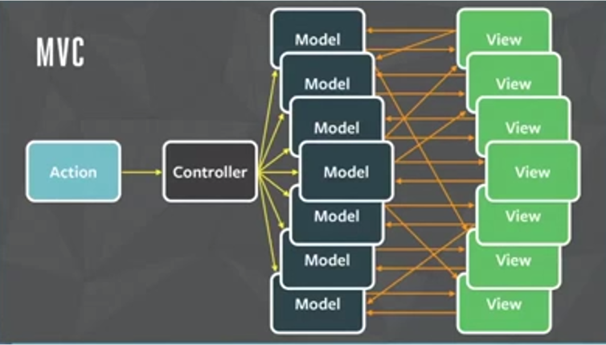
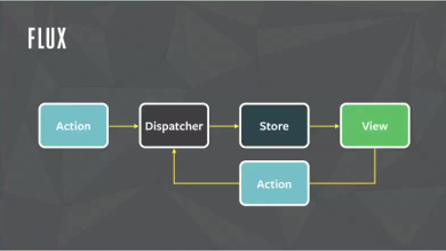
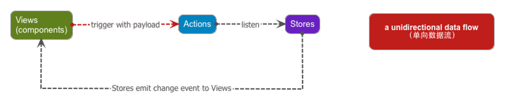
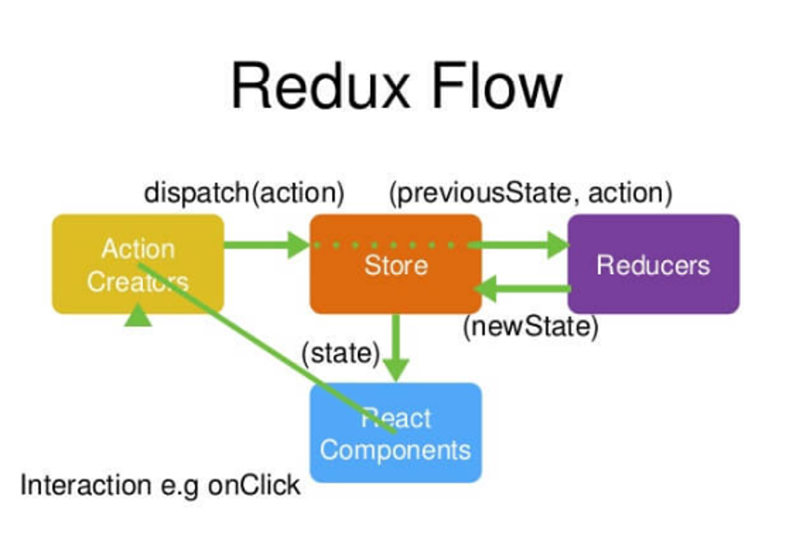
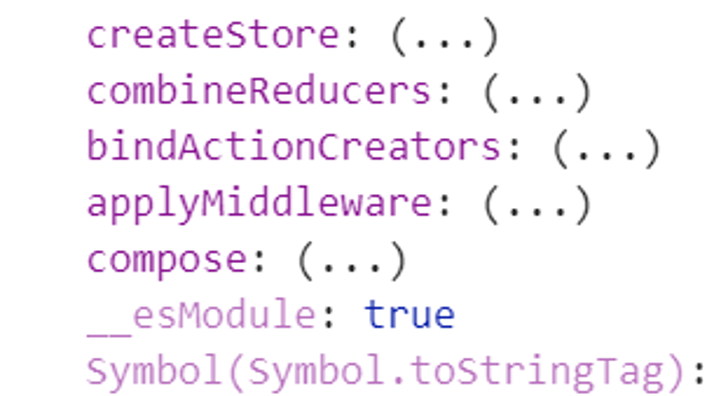
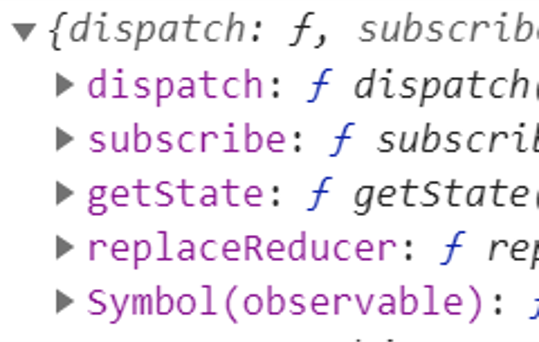
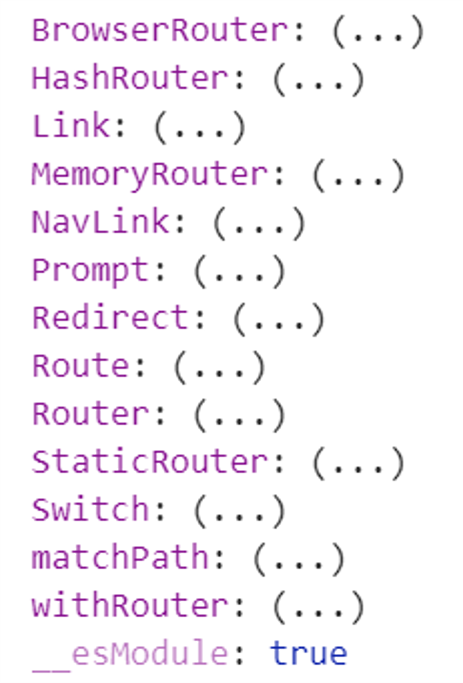
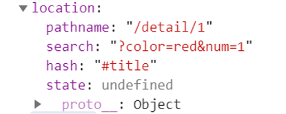
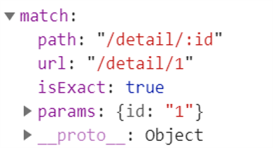
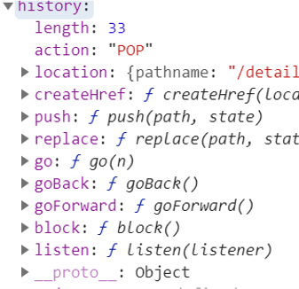

# React 第七天

## 一、Redux

### 11 flux

react为了解决组件之间通信问题（共享数据），提供了flux框架，实现了单一数据源，数据单向流动等特征。

​		 在传统的MVC框架中，模型可以访问视图，视图可以访问模型，这样多个模块交织在一起就形成了一个网状结构，此时新增一个模块，或者是删除一个模块成本是很高的。

​		 flux即使在此基础之上，提出的一个新的通信模型，数据始终朝着一个方向流动，形成了一个闭合的环，系统中即使有再多的这样的环，也可以看成是一个。

所以新增一个环或者删除一个环是不影响其它的环。





>   flux 通信

在flux中，由四部分组成：

​		 action 用户或者组件发布的消息

​		 dispatcher  用来捕获消息的模块

​		 store  存储数据的模块

​		 view  组件视图

通信流程

​		 一个组件发布了一个action， 

​		 action被dispatcher捕获到

​		 dispatcher处理消息，并将数据存储在store中

​		 store数据更新了，并将新的数据传递给另一个组件

>   reflux 和 redux

早期react团队只是提出了flux思想，并没有实现，所以很多开发者就基于flux思想，实现了自己的框架。

​	 reflux 基于状态通信的，

​			 主要在ES5开发中使用，

​	 redux 基于属性通信

​			 主要在ES6开发中使用。

### 1.2 reflux

基于flux思想实现的一个框架，简化了flux，也有数据单向流动等特征。

reflux有三步组成

​		 views  组件视图

​		 actions  消息对象

​		 stores  存储数据

通信流程

​		 一个组件发布了action，

​		 action被store捕获

​		 store根据消息类型处理数据，

​		 store将处理的结果传递给另一个组件



### 1.3 ==redux==

react也是基于flux思想实现的框架，实现了==单一数据源，数据单向流动==等特征。

> ​	redux由四部分组成
>
> ​			 components 组件视图
>
> ​			 actions 组件或者用户发布的消息
>
> ​			 store  存储数据
>
> ​			 reduers  捕获消息，处理消息
>

通信流程

​	 一个组件发布了一个`action`

​	 `action`通过`store`被`reducer`捕获到

​	 `reducer`根据消息类型处理数据。

​	 `reducer`将处理的结果传递给store存储

​	`store`数据更新了将新的数据传递给另一个组件

### 1.4 redux 特点

redux有三个特点

​	 1 单一数据源

​			 在一个应用程序中，有且只有一个store对象。

​	 2 state是只读的

​			 在store中，数据作为state来存储。

​			  state是只读的，不能修改，只能读取，即使在reducers中，也不能修改数据

​	 3 函数式编程

​			 redux为了简化我们开发，让我们使用函数式编程。

​			 在redux中，reduer就是函数，定义reducer就是定义一个函数。

### 1.5 redux 架构图



### 1.6 使用redux

redux跟axios一样，是一个公用的模块，作者希望可以在所有的框架中去使用，

在不同的框架中要使用不同的插件，例如：react中使用react-redux插件

redux模块

​	 `createStore`  用来创建store对象的方法

​			 参数是reducer，返回值就是store对象

​	 `combineReducers` 合并多个reducer

​	 `applyMiddleware` 拓展插件



### 1.7 action

`action`即是一个消息对象

​	 `type` 定义消息名称

​	 其它的属性定义数据，例如： data

消息名称通常是不变的，因此工作中，常常将消息==名称字母大写，横线分割单词，放在常量中。==

### 1.8 reducer

`reducer `是用来捕获消息对象的方法

​	 第一个参数表示状态数据对象（`state`），我们可以为其定义默认值，该默认值就是state初始的数据

​			 原因是：创建store的时候，默认会执行一次reducer方法，

​					 此时默认值就是初始化的状态数据，消息类型是@@redux/INTI

​	 第二个参数表示接收的`action`对象，在函数中，根据action类型，处理state数据

​			 注意：state是只读的，因此不能修改。否则会造成数据丢失的问题。

​			 但是如果数据是值类型，可以直接赋值修改，

​					 值类型的数据，赋值相当于复制。 引用类型的数据，赋值相当于引用。

​	 在reducer方法中，要返回新的state数据，表示更新的数据。

### 1.9 store 对象

==`store` 对象提供了一些方法==

​	 `dispatch` 用来发布消息的方法，类似vuex中的commit和dispatch

​			 参数就是action对象

​	 `subscribe` 用来监听store变化的（state变化）。

​			 监听的时候，一定要在发布消息之前监听。

​	 getState 获取state数据

​	 replaceReducer 替换原有的reducer



```js
// 引入核心库
import React, { Component } from "react";
// 引入redux
import { createStore } from "redux";

// 1.通常消息名称不会改变 所有可以定义常量
const ADD_NUM = 'ADD_NUM'
const DEL_NUM = 'DEL_NUM'
// 定义action 就是一个对象
// 通过 type 定义消息名称 其他属性定义数据
let addNum = { type: ADD_NUM, data: 5 }
let delNum = { type: DEL_NUM, data: 3 }

// 2.定义reducer
/* 
    第一个参数 初始状态值   通常state会给到一个默认值
    第二个参数 action消息对象 
*/
function reducer(state = 0, action) {
    // 利用Switch 捕获消息类型
    switch (action.type) {
        case ADD_NUM:
            state += action.data
            break;
        case DEL_NUM:
            state -= action.data
            break;
        default:
            break;
    }

    // 返回state
    return state
}

// 3.创建store
let store = createStore(reducer)

/* 
    subscribe 监听store变化的(state变化)
        在发布消息之前监听
    getState 获取state数据
*/
store.subscribe(() => console.log(store.getState()))

// 4.发布消息
store.dispatch(addNum)
store.dispatch(delNum)
```


### 1.10 观察者模式解决组件间通信

我们可以基于观察者模式来解决组件之间的通信：

​		 一个组件订阅消息

​		 一个组件发布消息

在组件中订阅消息，消息的回调函数可以接收数据，可以访问组件实例对象。

​		 所以可以用接收的数据更新组件的状态来实现通信。

​		 这种基于==状态==实现通信的方案就是reflux的实现。

观察者模式只是用来发布消息的框架，因此==不负责数据的存储==。所以在订阅之前发布的消息就丢失了。

```jsx
// 引入核心库
import React, { Component } from "react";
// 引入渲染库
import { render } from 'react-dom'

// 定义观察者对象
let observer = (function () {
  // 定义存储数据对象
  let _data = {}

  // 返回接口对象
  return {
    // 注册消息
    on(name, fn) {
      if (_data[name]) {
        _data[name].push(fn)
      } else {
        _data[name] = [fn]
      }
    },
    // 发布消息
    trigger(name, ...args) {
      // 遍历每一个消息函数
      _data[name] && _data[name].forEach(fn => fn(...args))
    }
  }
})()

// 定义类组件
class App extends Component {
  render() {
    return (
      <div>
        <button onClick={e => observer.trigger('reduceNum', 4)}>减少数字</button>
        <hr></hr>
        <AddNum></AddNum>
        <ShowNum></ShowNum>
      </div>
    );
  }
}

class AddNum extends Component {
  render() {
    return (
      <div>
        <button onClick={e => observer.trigger('addNum', 5)}>添加数字</button>
      </div>
    );
  }
}

class ShowNum extends Component {
  constructor(props) {
    super(props);
    this.state = {
      num: 10
    }
  }

  // 组件构建完毕
  componentDidMount() {
    // 监听数字增加的消息
    observer.on('addNum', (num) => this.setState({ num: this.state.num + num }))
    // 监听数字减少加的消息
    observer.on('reduceNum', (num) => this.setState({ num: this.state.num - num }))
  }

  render() {
    return (
      <div>
        <h1>结果: {this.state.num}</h1>
      </div>
    )
  }
}

// 观察者模式只是发布消息框架 不负责数据存储 所以在订阅之前发布消息就丢失了 
observer.trigger('addNum', 20);

render(<App></App>, app)
```


### 1.11 redux 解决组件间通信

redux是一个通用的框架，因此在不同的框架中使用，要安装相应的插件。

​		 在react中使用，要安装`react-redux`。

vuex之所以能够解决组件之间的通信，是因为vuex为每一个组件都拓展了

​		 发布消息的方法：commit和dispatch

​		 获取store的数据：state和getters

因此想在react中，使用redux解决通信，就要让每一个组件获取store中的state数据，以及发布消息的方法（dispatch）

​		 react-redux提供了`connect`方法以及`Provider`组件，可以解决上述问题。

​				 redux是通过==属性==传递数据实现的。

### 1.12 connect

该方法是用来为组件提供了`state`数据以及`dispatch`方法的。

​	 两个参数都是函数

​			 第一个参数函数表示：如何为组件的属性拓展state数据

​					 参数是state数据，返回值是为组件的属性拓展的state数据（还可以拓展更多的数据）

​			 第二个参数函数表示：如何为组件的属性拓展dispatch方法

​					  参数表示dispatch方法，返回值是为组件的属性拓展的dispatch方法（还可以拓展更多的方法）

connect方法返回一个函数（高阶函数）

​		 该函数创建的组件（高阶组件）可以接收state数据和dispatch方法。

​		 没有通过该函数处理的组件（包括原组件）是不会接收state数据和dispatch方法的。

### 1.13 Provider

该组件是为组件提供`store`数据源的。

​		 通过store属性提供数据源。属性值就是store对象

​		 我们可以将组件放在该组件内部，就可以接收数据了。

在react中使用redux共分两步

​		 第一步 通过connect方法拓展组件，接收state数据和dispatch方法

​		 第二步 通过Provider组件提供store数据源。

让其它的组件接收state数据和dispatch方法有两种方式：

​		 第一种：可以通过父子组件通信的方法，传递数据和方法

​		 第二种：继续使用connet方法得到的高阶函数拓展组件。

```jsx
// 引入核心库
import React, { Component } from 'react'
// 引入渲染库
import { render } from 'react-dom'
// 引入 redux
import { createStore } from 'redux'
// 引入 react-redux
import { connect, Provider } from 'react-redux'

// 消息常量
const ADD_NUM = 'ADD_NUM'
const DEAL_NUM = 'DEAL_NUM'
// 1.定义 action 消息对象
// 通过 type 定义消息名称 其他属性定义数据
let addNum = { type: 'ADD_NUM', data: 3 }
let dealNum = { type: 'DEAL_NUM', data: 2 }

// 2.定义 reducer 捕获消息对象
function reducer(state = 0, action) {
    // 捕获消息
    switch (action.type) {
        case ADD_NUM:
            state += action.data
            break;
        case DEAL_NUM:
            state -= action.data
            break;

        default:
            break;
    }
    // 返回结果
    return state
}

// 3.创建 store 存储数据
let store = createStore(reducer)

// 定义组件类
class App extends Component {
    render() {
        return (
            <div>
                <button onClick={e => this.props.dispatch(dealNum)}>减少数据</button>
                {/* a. 父子通信*/}
                <AddNum dispatch={this.props.dispatch}></AddNum>

                {/* b.继续使用connect方法得到高阶函数组件 */}
                {/* <DealAddNum></DealAddNum> */}
                <DealShowNum></DealShowNum>
            </div>
        );
    }
}
class AddNum extends Component {
    render() {
        return (
            <div>
                <button onClick={e => this.props.dispatch(addNum)}>增加数据</button>
            </div>
        );
    }
}
class ShowNum extends Component {
    render() {
        return (
            <div>
                <h2>结果 {this.props.state} </h2>
            </div>
        );
    }
}

// 使用 connect() 方法为组件拓展 state 和 dispatch 数据
let deal = connect(
    state => ({ state }),
    dispatch => ({ dispatch })
)

/* 
    让其他组件接收state数据和dispatch方法
        1.父子通信
        2.继续使用connect方法得到高阶函数组件
*/
// 返回的是高阶组件
let DealShowNum = deal(ShowNum)
let DealAddNum = deal(AddNum)
let DealApp = deal(App)

// 渲染
/* 
    Provider 为组件提供数据源 通过store提供数据源 属性值就是store
        将组件放在该组件内部
*/
render(
    <Provider store={store}>
        <DealApp></DealApp>
    </Provider>, app
)
```


## 二、路由

### 2.1 react 路由

react有三个特点：虚拟DOM，组件化开发，多端适配

​	 所以react路由为了适配多端，为不同的端提供了不同的路由模块

​			 在web端，使用 react-router-dom 模块

​			 在native端，使用 react-router-native 模块

​	 它们都依赖react-router模块

​			 所以要安装两个模块： react-router, `react-router-dom`

 注意：不同的react版本使用路由的方式不同。

### 2.2 使用路由

使用路由只需要两步，

​	 第一步 

​				 `Switch`				组件定义路由渲染位置		

​					 注意：可以不使用Switch组件，此时就不能保证同时只显示一个页面了

​				 `exact` 					是否精确匹配

​				`Route`					 组件定义路由规则

​				 `path` 				     定义规则（与vue规则是一样）

​				 `component` 	       定义组件
​						`name` 		            定义名称
​						`HashRouter`       	基于hash策略实现
​						`BrowserRouter`      基于path策略实现  
   							 需要服务器端配合：做重定向。实现的是多页面应用


​	 第二步 确定路由渲染策略

​			 `BrowserRouter` 基于path策略实现的，类似vue中的history策略

​				==需要服务器端配合：做重定向。实现的是多页面应用==

​			 `HashRouter` 基于hash策略实现的。

​					 实现的是单页面应用

​			用路由策略组件渲染应用程序组件。



```js
// 引入核心库
import React, { Component } from "react";
// 引入渲染库
import { render } from 'react-dom'
// 引入路由模块
import { Route, HashRouter, Switch, BrowserRouter } from 'react-router-dom'
/* 
    Route             组件定义路由规则
    Switch            组件定义路由渲染位置
    component 		 定义组件
    name 		     定义名称
    HashRouter       基于hash策略实现
    BrowserRouter    基于path策略实现  
        需要服务器端配合：做重定向。实现的是多页面应用
*/

// 定义组件
class App extends Component {
    render() {
        return (
            <div>
                {/* 1.exact 是否精确匹配 */}
                {/* <Route path='/' component={Home} name='home' exact></Route> */}
                {/* 动态路由 */}
                {/* <Route path='/list/:page' component={List} nanme='list'></Route> */}
                {/* 详情页动态路由 */}
                {/* <Route path='/detail/:id' component={Detail} name='detail'></Route> */}

                {/* 2.通常定义路由的位置使用 Switch 组件 */}
                <Switch>
                    {/* 动态路由 */}
                    <Route path='/list/:page' component={List} nanme='list'></Route>
                    {/* 详情页动态路由 */}
                    <Route path='/detail/:id' component={Detail} name='detail'></Route>
                    {/* 2.1 通常首页放到最下面匹配 */}
                    <Route path='/' component={Home} name='home'></Route>
                </Switch>
            </div>
        );
    }
}
class Home extends Component {
    render() {
        return (
            <div>
                <h1> home component</h1>
            </div>
        );
    }
}
class List extends Component {
    render() {
        return (
            <div>
                <h1> List component</h1>
            </div>
        );
    }
}
class Detail extends Component {
    render() {
        return (
            <div>
                <h1> Detail component</h1>
            </div>
        );
    }
}

// 2.基于hash策略
// 渲染
// render(
//     <HashRouter>
//         <App></App>
//     </HashRouter>
//     , app
// )

// 3.基于 Path 策略 需要搭建服务器	(服务器端的重定向)  绝对路径	
//  <!-- 引入文件 BrowserRouter使用绝对路径 -->
//  <script src="/dist/main.js"></script>
render(
    <BrowserRouter>
        <App></App>
    </BrowserRouter>
    , app
)
```

```js
// 引入express
const express = require('express');
// 引入ejs
const ejs = require('ejs');
// 获取应用
const app = express();

// 配置引擎
app.engine('html', ejs.__express);
// 开放目录权限
app.use('/dist', express.static('./dist/'));


// 渲染页面 (服务器端的重定向)
app.get('*', (req, res) => {
    // 渲染页面
    res.render('../index.html');
})

// 监听端口号
app.listen(3000, () => console.log(3000));
```


### 2.3 路由拓展

- **路由重定向**

  ​	在React路由中，通过`Redirect`组件实现路由重定向

  ​			 `from`  	定义匹配的地址

  ​			 `to` 		 定义重定向的地址

- **默认路由**

  ​	在React路由中，我们将`path`属性匹配`*`，既可以定义==默认路由==。

  ​			 由于默认路由匹配的很广，因此常常写在最后面。

- **路由导航**

  ​	为了切换页面，React路由提供了路由导航组件：`Link`组件

  ​			 通过to属性定义切换的地址，即使是hash策略，不要以#开头。

  ​			 Link组件只能渲染成a标签。

   			与a标签相比，Link组件可以适配不同的路由策略。

  ```js
  import React, { Component } from "react";
  import { render } from 'react-dom'
  // 引用路由模块
  import { Route, Switch, HashRouter, BrowserRouter, Link, Redirect } from 'react-router-dom'
  
  class App extends Component {
      render() {
          return (
              <div>
                  <Header></Header>
  
                  <Switch>
                      {/* 1.路由重定向 Redirect
                          from 定义匹配地址
                          to   定义重定向地址 */}
                      <Redirect from='/abc' to='/list/2'></Redirect>
  
                      <Route path='/list/:page' component={List} name='list'></Route>
                      <Route path='/detail/:id' component={Detail} name='detail'></Route>
  
                      {/* 2.默认路由 匹配范围广 通常放在最后 */}
                      <Route path='*' component={Home} name='home'></Route>
                  </Switch>
              </div>
          );
      }
  }
  class Header extends Component {
      render() {
          return (
              <div>
                  {/* 3.路由导航
                          Link 通过 to属性定义切换地址 */}
                  <h2>路由导航</h2>
                  <Link to='/'>home</Link>&emsp;
                  <Link to='/list/1'>list</Link>&emsp;
                  <Link to='/detail/1'>detail</Link>
              </div>
          );
      }
  }
  class List extends Component {
      render() {
          return (
              <h1>List component</h1>
          );
      }
  }
  class Detail extends Component {
      render() {
          return (
              <h1>Detail component</h1>
          );
      }
  }
  class Home extends Component {
      render() {
          return (
              <h1>Home component</h1>
          );
      }
  }
  
  // 渲染
  // hash
  render(<HashRouter><App></App></HashRouter>, app)
  ```

  

### 2.4 路由数据

通过`Route`组件渲染页面组件可以通过属性获取路由数据

​		 `match`：包含对路由规则解析的数据，

​					如：path，url，isExact，params（动态路由数据）

​		 `location`：包含当前真实地址的信息（类似全局的location），

​					如：pathName，search， hash等

​		 `history`：包含对路由操作的方法，（类似全局的history），

​					如：push， replace，go， goBack，goForward等

==没有通过`Route`组件渲染的组件不具有路由数据==，想获取路由数据，有三种方式：

​		 1 父子组件通信的方式传递数据可以传递部分数据

​		 2 继续使用Route组件渲染该组件

​		 3 使用`withRouter`方法拓展高阶组件。







```jsx
import React, { Component } from "react";
import { render } from 'react-dom'
// 引用路由模块
import { Route, Switch, HashRouter, Link, withRouter } from 'react-router-dom'

class App extends Component {
    render() {
        console.log('app', this.props);
        return (
            <div>
                {/* <Header></Header> */}
                {/* 3.使用 */}
                <DealRouteHeader></DealRouteHeader>
                
                <Switch>
                    <Route path='/list/:page' component={List} name='list'></Route>
                    <Route path='/detail/:id' component={Detail} name='detail'></Route>
                    <Route path='*' component={Home} name='home'></Route>
                </Switch>
            </div>
        )
    }
}


class Header extends Component {
    render() {
        console.log('header', this.props);
        return (
            <div>
                {/* 路由导航 */}
                <Link to='/'>home</Link>&emsp;
                <Link to='/list/1'>list</Link>&emsp;
                <Link to='/detail/1'>detail</Link>
            </div>
        )
    }
}
class Home extends Component {
    render() {
        return (
            <h1>Home component</h1>
        );
    }
}
class List extends Component {
    render() {
        return (
            <h1>List component</h1>
        );
    }
}
class Detail extends Component {
    render() {
        return (
            <h1>Detail component</h1>
        );
    }
}

// 没有通过Route组件渲染的组件不具有路由数据
/* 
    获取路由数据 三种方式
        1.父子通信传递部分数据
        2.使用Route渲染该组件
        3.使用 withRouter 方法拓展高阶组件 常用
*/

// 2.使用Route渲染该组件
// render(
//     <HashRouter>
//         <Route component={App}></Route>
//     </HashRouter>
//     , app)

// 3.使用 withRouter
let DealRouteHeader = withRouter(Header);


// hash策略渲染
render(<HashRouter><App></App></HashRouter>, app)
```

### 2.5 路由中使用 redux

在路由中使用`redux`就是让所有的组件都可以==获取路由数据以及store数据。==

​		 1 通过`dealFn`拓展高阶组件，接收store中所有的数据

​		 2 通过`withRouter`拓展高阶组件，接收路由中所有的数据

​		 3 通过`Route`组件渲染页面组件，传递路由中所有的数据

​		 4 通过父子组件通信的方式，传递所有或者部分路由以及store中的数据。

注意：在App组件中，通过Route组件渲染了页面组件，那么：

​		 App组件与页面组件不是直接的父子关系，不能直接传递属性数据

​		 App组件与Route组件是直接的父子关系，可以传递数据，但是Route组件内部是不会接收。

 我们在`Provier`中使用路由策略组件，去渲染应用程序组件。理论上Provider和路由策略组件没有先后顺序。

```jsx
import React, { Component } from "react";
import { render } from 'react-dom'
// 引入redux模块
import { createStore } from 'redux'
// 引入react-redux
import { connect, Provider } from 'react-redux'
// 引入路由模块
import { Route, Switch, HashRouter, BrowserRouter, Redirect, Link, withRouter } from 'react-router-dom'

// 消息常量
const ADD_NUM = 'ADD_NUM'
const DEL_NUM = 'DEL_NUM'
// 1.消息对象
let addNum = { type: ADD_NUM, data: 3 }
let delNUm = { type: DEL_NUM, data: 2 }

// 2.定义reducer
function reducer(state = 0, action) {
  // 捕获消息
  switch (action.type) {
    case 'ADD_NUM':
      state += action.data
      break;
    case 'DEL_NUM':
      state += action.data
      break;

    default:
      break;
  }
  // 返回结果
  return state
}

// 3.创建store 
let store = createStore(reducer)

class App extends Component {
  render() {
    console.log('app', this.props);
    return (
      <div>
        <Header></Header>

        <Switch>
          {/* 路由重定向 */}
          <Redirect from='abc' to='/'></Redirect>
          <Route path='/list/:page' component={List} name='list'></Route>
          <Route path='/Detail/:id' component={Detail} name='detail'></Route>
          <Route path='*' component={Home} name='home'></Route>
        </Switch>
      </div>
    );
  }
}
class Header extends Component {
  render() {
    return (
      <div>
        {/* 自定义导航 */}
        <Link to='/'>home</Link>&emsp;
        <Link to='/list/1'>list</Link>&emsp;
        <Link to='/detail/1'>detail</Link>
      </div>
    );
  }
}
class Home extends Component {
  render() {
    return (
      <h1>Home component</h1>
    );
  }
}
class List extends Component {
  render() {
    return (
      <h1>List component</h1>
    );
  }
}
class Detail extends Component {
  render() {
    return (
      <h1>Detail component</h1>
    );
  }
}

// 1.使用connect方法 为组件拓展store 和 dispatch
let deal = connect(
  state => ({ store }),
  dispatch => ({ dispatch })
)

// 2.先拓展store数据再拓展路由数据 否则会造成页面和路由无法同步

// 拓展store数据
let DealStoreApp = deal(App)
//  拓展路由数据  withRouter()
let DealRouteApp = withRouter(DealStoreApp)

// hash 策略
render(
  // 3.Provider 为组件提供数据源

// 组件之间的嵌套没有顺序的 Provider和HashRouter互相包裹都可以
  <Provider store={store}>
    <HashRouter>
      <DealRouteApp></DealRouteApp>
    </HashRouter>
  </Provider>
  , app
)
```


## 三、Redux拓展

### 3.1 reducer 拓展

==路由模块也提供了`reducer`==，所以整个应用程序中就有了两个reducer：

 		一个是路由reducer

​		 一个是自定义的reducer

为了使用多个reduer，redux提供了`combineReducers`方法，可以合并多个reducer。

​		 参数是对象：key 表示命名空间，value 表示reducer方法

​		 combineReducers功能类似vuex中的modules属性：store切割的。

​		 store中数据存储在state中，因此对store的切割本质上就是对state的切割。

​				 所以只有state需要添加命名空间、

工作中，如果应用程序非常复杂，将所有的数据放在一起可能会产生冲突，我们可以拆分reduer。

```js
import React, { Component } from "react";
import { render } from 'react-dom'
// 引入redux
import { createStore, combineReducers } from "redux";
// 引入路由模块
import { Route, Switch, HashRouter, BrowserRouter, Link, Redirect, withRouter } from 'react-router-dom'
// 引入 react-redux
import { connect, Providers } from 'react-redux'
// 路由模块也提供了reducer
import { routerReducer } from "react-router-redux";

// 消息常量
const ADD_NUM = 'ADD_NUM'
const DEL_NUM = 'DEL_NUM'
// .消息对象
let addNum = { type: ADD_NUM, data: 5 }
let delNum = { type: DEL_NUN, data: 2 }

// .定义reducer
function reducer(state = 0, action) {
    // 捕获消息
    switch (action.data) {
        case ADD_NUM:
            state += action.data
            break;
        case DEL_NUN:
            state -= action.data
            break;

        default:
            break;
    }
    // 返回
    return state
}

// 1.切割store  路由模块也提供了reducer，所以整个应用程序中就有了两个reducer
// 为了使用多个reduer，redux提供了combineReducers方法，可以合并多个reducer
let store = createStore(combineReducers({
    // key 表示命名空间，value 表示reducer方法
    routerReducer: routerReducer,   // 对应路由模块中的reducer
    demo: reducer   //demo 对应 自定义的reducer
}))

class App extends Component {
    render() {
        console.log('app', this.props);
        return (
            <div>
                <button onClick={e => this.props.dispatch(addNum)}>添加数字</button>
                <Header {...this.props}></Header>
            </div>
        );
    }
}

class Header extends Component {
    render() {
        return (
            <div>
                <h1>header component {this.props.state.demo}</h1>
            </div>
        );
    }
}
render(<App></App>, app)
```


### 3.2 state拓展

在redux中，state是不能修改的，只能读取，

**在reducer中，state之所以被直接修改，是因为state是值类型的**

​		 值类型的数据赋值相当于复制

​		 引用类型的数据赋值相当于引用

- **如果state是引用类型的，此时操作state分成三步**

  ​		 第一步 定义结果对象

  ​		 第二步 用state和action去修改结果对象

  ​		 第三步 将结果对象和state合并到新对象中，并返回新对象

注：

​		 1 先合并state，再合并结果对象，这样就可以让result中的新的属性数据覆盖state数据

 		2 ES6提供了Object.assign方法，可以用来合并多个对象。

工作中，我们还常常在第一步将state合并到结果对象中，这样最后一步就可以直接返回结果对象。

```js
import React, { Component } from "react";
import { render } from 'react-dom'
// 引用redux
import { createStore } from "redux";
// 引入react-redux
import { connect, Provider } from 'react-redux';

// 消息常量
const ADD_NUM = 'ADD_NUM'
const DEL_NUM = 'DEL_NUM'
// 消息对象
let addNum = { type: ADD_NUM, data: 3 }
let delNum = { type: DEL_NUM, data: 2 }

// 引用类型
let defaultState = { num: 0 }
// 定义reducer
function reducer(state = defaultState, action) {
    /* // 1.定义结果对象
    let result = {}
    // 捕获消息
    switch (action.type) {
        case ADD_NUM:
            // 2.使用state和action去修改结果对象
            result.num = state.num + action.data
            break;
        case DEL_NUM:
            result.num = state.num - action.data
            break;
        default:
            break;
    }
    // 返回结果 将结果对象和state合并到新对象中，并返回新对象
    return Object.assign({}, state, result) */

    // 2.简化
    // 1.在第一步合并生成对象
    let result = Object.assign({}, state)

    switch (action.type) {
        case ADD_NUM:
            result.num += action.data
            break;
        case DEL_NUM:
            result.num += action.data
            break;

        default:
            break;
    }
    // 2.返回结果对象
    return result
}

// 创建 store
let store = createStore(reducer)

// 定义组件
class App extends Component {
    render() {
        console.log('app', this.props);
        return (
            <div>
                <button onClick={e => this.props.dispatch(addNum)}>添加数字</button>
                {/* 使用组件 */}
                <Header {...this.props}></Header>
            </div>
        );
    }
}
class Header extends Component {
    render() {
        console.log('header', this.props);
        return (
            <div>
                <h1>header part -- {this.props.state.num}</h1>
            </div>
        );
    }
}

// 使用connect高阶函数
let deal = connect(
    state => ({ state }),
    dispatch => ({ dispatch })
)


// 拓展store数据
let DealStoreApp = deal(App);


// 渲染 
render(
    <Provider store={store}>
        <DealStoreApp></DealStoreApp>
    </Provider>
    , app);
```


### 3.3 action 拓展

在redux中，action共分两大类：

 第一类：同步action，

 包括：静态action，动态action

 第二类：异步action

#### 3.3.1 同步action

##### 静态action

 静态action就是一个对象：type 定义类型，其它属性定义数据

 我们目前定义的action都是静态action

 由于静态action中数据是不变的，因此使用的时候不够灵活。适用性不强。

```js
// 静态action
let addNum5 = { type: ADD_NUM, data: 5 }
```

##### 动态action

 动态action是一个方法，使用的时候要执行，并传递数据

 在方法中，返回action对象，action对象中，存储参数数据

 这样action中的数据是灵活可变的，适用性强，工作中常用。动态action与拓展属性方法的区别是：

 拓展属性方法可以灵活传递数据，但是会污染组件的属性对象

 动态action可以灵活传递的数据，并且不会污染组件的属性对象，工作中常用。

```js
// 2.动态action
let addNum = num => ({ type: ADD_NUM, data: num })
```

##### 中间件

==redux默认不支持异步aciton==，想使用异步action要为redux安装中间件插件。

redux模块提供了`applyMiddleware`方法

```markup
     参数是中间件
```

 返回值是一个方法，用来拓展createStore方法

 返回值又是一个新的createStore方法。

 用该方法创建的store就支持异步action了。

异步action中间件插件：redux-thunk。

#### 3.3.2 异步action

在一个组件中发送请求，获取的数据要在其它的组件中使用。此时可以使用异步action

异步action跟动态action类似，

 是一个方法，参数是传递的数据

 返回值是一个方法

 第一个参数是dispatch（常用）

 第二个参数是getState

```markup
             在方法中，做异步事情。异步结束之后，再发布同步消息。
```


```js
// 引入核心库
import React, { Component } from "react";
// 引入渲染库
import { render } from 'react-dom'
// 引入 react-redux
import { connect, Provider } from 'react-redux'
import { applyMiddleware } from "redux";
// 引入redux模块
// redux模块提供了 applyMiddleware 方法支持异步action
import { createStore } from 'redux'
// 引入中间件
import ReduxChunk from 'redux-thunk'

// 消息常量
const ADD_NUM = 'ADD_NUM'
const DEL_NUM = 'DEL_NUM'
const CLEAR_NUM = 'CLEAR_NUM'

// 消息对象
// 静态action
let addNum5 = { type: ADD_NUM, data: 5 }
let delNum3 = { type: DEL_NUM, data: 3 }

// 2.动态action
let addNum = num => ({ type: ADD_NUM, data: num })
let clearNum = num => ({ type: CLEAR_NUM, data: num })


// 3.定义异步action
let getData = prop => (
  // 返回值是一个方法
  dispatch => {
    setTimeout(() => {
      dispatch(clearNum(prop))
    }, 2000);
  }
)

// 定义reducer
// 引用类型
let defaultState = { num: 3 }
function reducer(state = defaultState, action) {
  // 合并生成对象
  let result = Object.assign({}, state)

  // 捕获消息
  switch (action.type) {
    case ADD_NUM:
      result.num += action.data
      break;
    case DEL_NUM:
      result.num -= action.data
      break;
    // 匹配定时器清楚消息对象
    case CLEAR_NUM:
      result.num = action.data
      break;

    default:
      break;
  }

  // 返回消息
  return result
}

// 创建store
// let store = createStore(reducer)

// 3.配置store 支持异步action
// let reduxChunk = applyMiddleware(ReduxChunk);
// let newCreateStore = reduxChunk(createStore);
// let store = newCreateStore(reducer);
// 合并一步
let store = applyMiddleware(ReduxChunk)(createStore)(reducer)

// 定义组件
class App extends Component {
  render() {
    console.log('header', this.props);
    return (
      <div>
        <button onClick={e => this.props.dispatch(addNum5)}>添加数字5</button>
        <hr></hr>

        {/* 1.拓展属性 会污染其他组件 */}
        {/* <button onClick={e =>this.props.addNum(20)}>添加数字20</button> */}
        <hr />

        {/* 2.使用动态action */}
        <button onClick={e => this.props.dispatch(addNum(10))}>添加数字10</button>
        <hr />

        {/* 3.发布异步消息 */}
        <button onClick={e => this.props.dispatch(getData(0))}>定时清空数字</button>
        {/* 使用组件 */}
        <Header {...this.props}></Header>

        <hr />
        <Show {...this.props}></Show>
      </div>
    );
  }
}
class Header extends Component {
  render() {
    console.log('header', this.props);
    return (
      <div>
        <button onClick={e => this.props.dispatch(delNum3)}>减少数字3</button>
      </div>
    );
  }
}

class Show extends Component {
  render() {
    return (
      <div>
        结果: {this.props.state.num}
      </div>
    );
  }
}

let deal = connect(
  state => ({ state }),
  dispatch => ({
    dispatch,
    // 1.拓展属性方法
    addNum(num) {
      dispatch({ type: ADD_NUM, data: num })
    }
  })
)

// 拓展store数据
let DealStoreApp = deal(App)

// 渲染
render(
  <Provider store={store}>
    <DealStoreApp></DealStoreApp>
  </Provider>
  , app)
```

