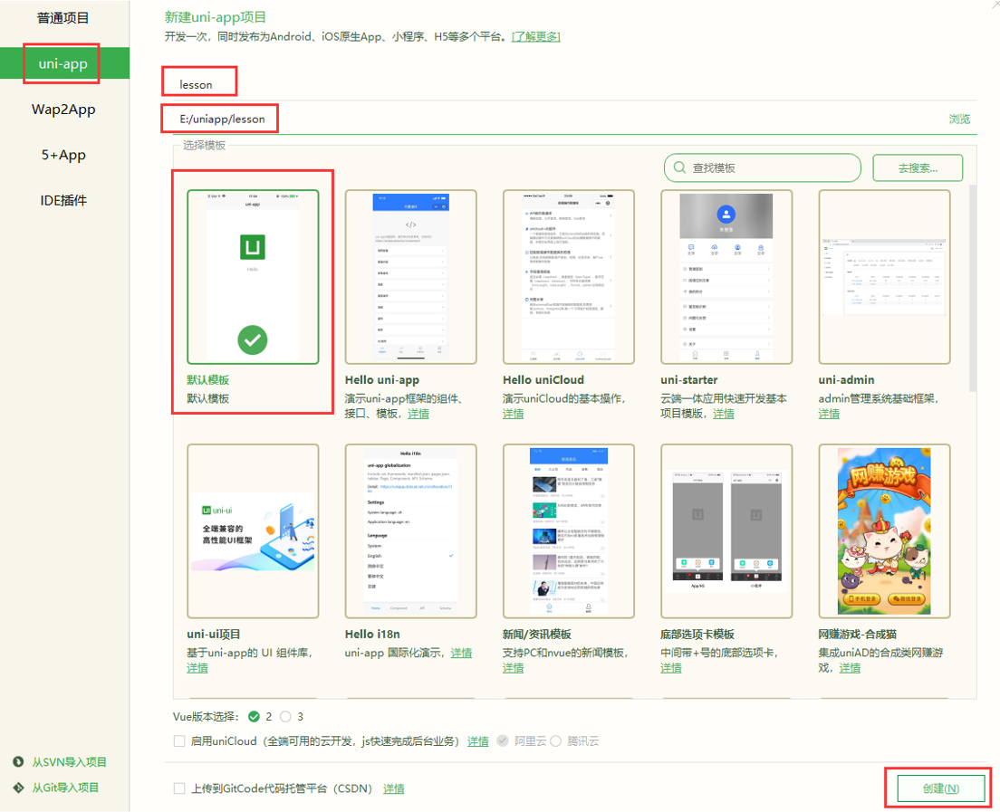
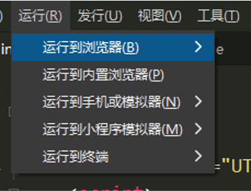
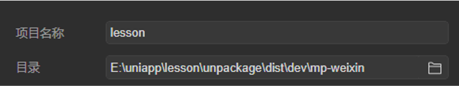
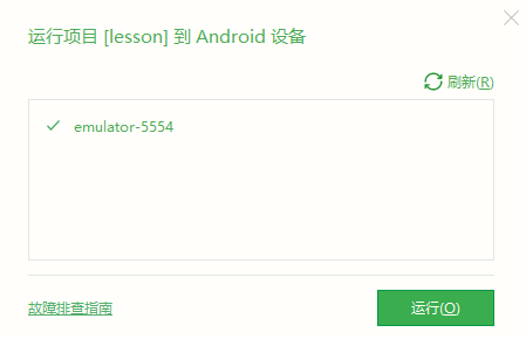
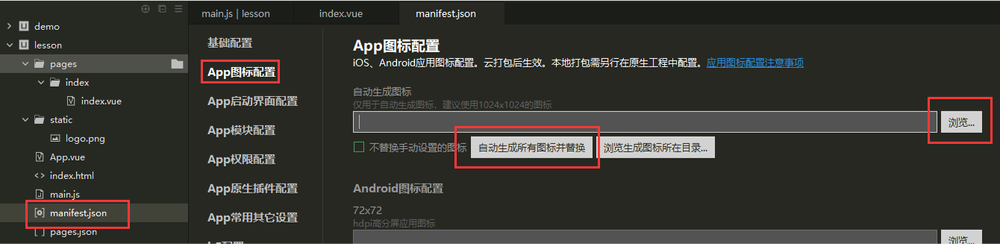
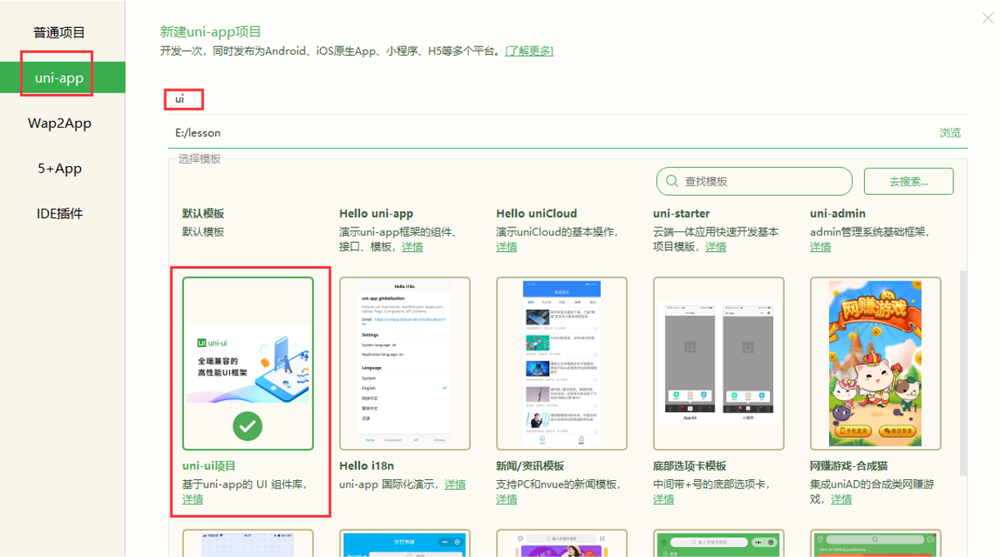
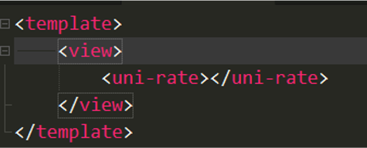

# Vue 第十四天

## 一、uni-app

### 1.1 uni-app介绍

uni-app是一个基于vue框架开发所有端应用的框架，开发者编写一套代码，可发布到iOS、Android、H5、以及各种小程序（微信/支付宝/百度/头条/QQ/钉钉）

等多个平台。

 	具有vue和微信小程序的开发经验，可快速上手uni-app

为什么要去学习uni-app？

 	减少了学习成本，因为只学会uni-app之后，即可开发出iOS、Android、H5、以及各种小程序的应用，不需要再去学习开发其他应用的框架，相对公司而言，也大大减少了开发成本


### 1.2 环境的按键

安装编辑器HbuilderX  

  	下载地址:  [https](https://www.dcloud.io/hbuilderx.html)[://www.dcloud.io/hbuilderx](https://www.dcloud.io/hbuilderx.html)[.html](https://www.dcloud.io/hbuilderx.html)

​	  HBuilderX是通用的前端开发工具，但为uni-app做了强化

安装微信开发者工具:

 	下载地址： [https](https://developers.weixin.qq.com/miniprogram/dev/devtools/download.html)[://developers.weixin.qq.com/miniprogram/dev/devtools/download](https://developers.weixin.qq.com/miniprogram/dev/devtools/download.html)[.html](https://developers.weixin.qq.com/miniprogram/dev/devtools/download.html) 


### 1.3 创建项目

 点击HbuilderX菜单栏

​	 文件 > 项目 > 新建 > 选择uni-app > 填写项目名称 > 项目创建的目录 > 点击创建按钮




### 1.4 目录结构

pages.json 			  全局配置

​		如：页面路径、窗口样式、原生的导航栏、底部的原生tabbar 等

manifest.json  		应用的配置文件

​		如：应用的名称、图标、权限等

App.vue  				 应用程序组件

​		所有页面都在App.vue下切换，可以调用应用的生命周期函数

main.js 				 项目入口文件

​		用于初始化vue实例并安装需要的插件。

uni.scss 				整体控制应用的风格

​		预置了scss变量，如：按钮颜色、边框风格，

unpackage 		 打包目录

​		包含各个平台的打包文件

pages  				所有页面存储目录

static 				静态资源目录

​		如：图片等

components 	所有组件存放目录


### 1.5 运行项目

**（1）运行H5项目**

​	 以chrome为例

​	 运行 => 运行到浏览器（或运行到内置浏览器）=> chrome


**（2）运行小程序项目**

​		以微信小程序为例

​		 运行 => 运行到小程序模拟器 => 微信开发者工具

​		 打开微信开发者工具 => 选择小程序项目目录

​		 项目目录/unpackage/dist/dev/mp-weixin

**注意**：如果是第一次使用，需要先配置小程序ide的相关路径，才能运行成功。如下图，需在输入框输入微信开发者工具的安装路径。

**注意**：微信开发者工具需要开启服务端口 在微信工具的设置->安全中。


**（3）运行App项目**

​		`adb devices`

​		 以android为例

 		运行 => 运行到手机或模拟器 => 运行到Android App基座 => 选择模拟器

​		 注意：模拟器API版本建议是30版本，版本太高，太低有兼容性问题








### 1.6 配置

**更换图标**

点击“mainifest.json文件”=>“App图标配置”=>“浏览” =>“自动生成所有图标并替换” ，替换图标




**page.json配置**

​	globalStyle 定义全局配置

​			 navigationBarTextStyle 导航栏标题颜色及状态栏前景颜色，仅支持 black/white

​			 navigationBarTitleText 导航栏标题文字内容

​			 navigationBarBackgroundColor 导航栏背景颜色（同状态栏背景色），如"#000000"

​			 backgroundColor 窗口的背景色


​	pages 配置页面（第一个成员为首页）

​			 style 页面样式配置

​			  navigationBarTitleText 页面导航栏标题文字内容

​			 enablePullDownRefresh 是否开启下拉刷新


```json
{
	"pages": [ //pages数组中第一项表示应用启动页，参考：https://uniapp.dcloud.io/collocation/pages
		{
			"path": "pages/index/index",
			"style": {
				"navigationBarTitleText": "uni-app"
			}
		}
	    ,{
            "path" : "pages/demo/demo",
            "style" :                                                                                    
            {
				// 页面配置
                "navigationBarTitleText": "hello",
                "enablePullDownRefresh": false
            }
            
        }
        ,{
            "path" : "pages/data/data",
            "style" :                                                                                    
            {
                "navigationBarTitleText": "",
                "enablePullDownRefresh": false
            }
            
        }
        ,{
            "path" : "pages/directive/directive",
            "style" :                                                                                    
            {
                "navigationBarTitleText": "",
                "enablePullDownRefresh": false
            }
            
        }
        ,{
            "path" : "pages/request/request",
            "style" :                                                                                    
            {
                "navigationBarTitleText": "",
                "enablePullDownRefresh": false
            }
            
        }
        ,{
            "path" : "pages/router/router",
            "style" :                                                                                    
            {
                "navigationBarTitleText": "",
                "enablePullDownRefresh": false
            }
            
        }
        ,{
            "path" : "pages/parent/parent",
            "style" :                                                                                    
            {
                "navigationBarTitleText": "",
                "enablePullDownRefresh": false
            }
            
        }
        ,{
            "path" : "pages/ui/ui",
            "style" :                                                                                    
            {
                "navigationBarTitleText": "",
                "enablePullDownRefresh": false
            }
            
        }
    ],
	"tabBar": {
		"list": [
			{
				"pagePath": "pages/index/index",
				"iconPath": "/static/logo.png",
				"text": "home"
			},
			{
				"pagePath": "pages/demo/demo",
				"iconPath": "/static/logo.png",
				"text": "demo"
			},
			{
				"pagePath": "pages/data/data",
				"iconPath": "/static/logo.png",
				"text": "data"
			},
			{
				"pagePath": "pages/router/router",
				"iconPath": "/static/logo.png",
				"text": "router"
			}
		]
	},
	// 全局配置
	"globalStyle": {
		"navigationBarTextStyle": "black",
		"navigationBarTitleText": "爱创乐育",
		"navigationBarBackgroundColor": "#F8F8F8",
		"backgroundColor": "#F8F8F8"
	},
	// 配置ui
	"easycom": {
		"autoscan": true,
		"custom": {
			"uni-(.*)": "node_modules/@dcloudio/uni-ui/lib/uni-$1/uni-$1.vue"
		}
	}
}

```


### 1.7 常用组件

text 文本组件，行内标签（除了文本节点以外的其他节点都无法长按选中）

view  视图容器

button 按钮

image  图片组件

 ……

 注：内置组件的属性引用微信小程序中的


```js
<template>
	<!-- 有且只有一个根元素 -->
	<view>
		<!-- text 文本组件 不会独占一行 -->
		<text>hello demo</text>
		<text>demo hello </text>
		
		<!-- 视图组件 独占一行 -->
		<view hover-class="box">视图组件 独占一行</view>
		
		<!-- 按钮组件 -->
		<button type="default">提交</button>
		<button type="warn">重置</button>
		
		<!-- 图片组件 -->
		<image src="../../static/logo.png"></image>
	</view>
</template>

<script>
</script>

<style>
	.box {
		color: red;
	}
</style>
```


### 1.8 模型数据

模型数据的定义使用的是Vue的语法

​	 data  静态数据

​	 computed  计算属性数据

​	 watch  数据监听

​	 methods  定义方法

​	 ……


```vue
<template>
	<view>
		<!-- 使用的是vue的语法 -->
		<input type="text" v-model="msg">
		<view>{{msg}}</view>
		
		<!-- 计算属性数据 -->
		<view>{{dealMsg}}</view>
		
		<!-- 方法 -->
		<button @tap="execMethod">切换显影</button>
		<view v-show="isShow">hello world</view>
	</view>
</template>

<script>
	export default {
		data() {
			return {
				msg:'hello msg',
				isShow:true
			}
		},
		methods: {
			execMethod() {
				console.log('方法执行...')
				this.isShow = !this.isShow
			}
		},
		// 数据监听
		watch:{
			msg(newValue) {
				console.log(newValue)
			}
		},
		// 计算属性数据
		computed:{
			dealMsg(v) {
				return v.msg.toUpperCase()
			}
		}
	}
</script>
```


### 1.9 插值指令

插值语法：  {{}}							  可以使用表达式以及方法	仍然不支持属性值使用插值符号 （小程序支持）

动态属性： v-bind:    					语法糖  :

绑定事件 v-on:click="fn"  			 语法糖  @

循环模板指令： v-for="(item, index) in arr"  :key="index"

条件模板指令： v-if， v-else-if, v-else

插值符号中可以使用js表达式


```vue
<template>
	<view>
		<!-- 插值:	仍然不支持属性值使用插值符号 （小程序支持） -->
		<!-- 绑定变量 需要v-bind 动态绑定 -->
		<view :class="data">hello view</view>
		
		<!-- 插值符号中可以使用js表达式 -->
		<view> {{msg.toUpperCase().slice(0,3)}}</view>
		
		<!-- 循环模板指令 -->
		<view>
			<view v-for="(item,index) in colors" :style="{
				backgroundColor:index % 2 ? 'pink' : 'red'
			}">
				{{item}}
			</view>
		</view>
		
		<!-- 条件模板指令 -->
		<button @click="num++">点我</button>
		<view v-if="num === 1">Angular</view>
		<view v-else-if="num === 2">React</view>
		<view v-else-if="num === 3">Vue</view>
		<view v-else>学不会</view>
	</view>
</template>

<script>
	export default {
		data() {
			return {
				msg:"hello msg",
				colors:['red','blue','gold'],
				data:'box',
				num:0
			}
		},
		methods: {
			
		}
	}
</script>
```


### 1.10 生命周期

生命周期：一个对象从创建、运行、销毁的整个过程被成为生命周期。


 	在生命周期中每个阶段会伴随着每一个函数的触发，这些函数被称为生命周期函数

​	 uni-app继承了微信小程序的应用程序生命周期

​			 onLaunch 当uni-app 初始化完成时触发（全局只触发一次）

​			 onShow 当 uni-app 启动，或从后台进入前台显示

​			 onHide 当 uni-app 从前台进入后台


uni-app支持vue与微信小程序提供的页面（组件）生命周期函数

​		微信提供：

​			 onLoad：页面加载（参数为上个页面传递的数据）

​			 onShow：页面显示（页面出现在屏幕上）

​			 onHide：页面隐藏

​			 onReady： 页面初次渲染完成

​			 onUnload：页面卸载


​	Vue提供：

​			 beforeCreate：组件创建前 

​		 	created：组件创建后 

​			 beforeMount：组件构建前 

​			 mounted：组件构建后  

​			 beforeUpdate：组件更新前 

​			 updated：组件更新后 

​			 beforeDestroy：组件销毁前 

​			 destoryed：组件销毁后

页面创建触发顺序：beforeCreate， onLoad，onShow ，created ，beforeMount ， onReady，mounted


```vue
<template>
	<view>
		<input type="text" v-model="msg">
		<view>hello msg</view>
	</view>
</template>

<script>
	export default {
		data() {
			return {
				msg:'hello msg'
			}
		},
		methods: {
			
		},
		/* 
		微信提供：
			 onLoad：页面加载（参数为上个页面传递的数据）
			 onShow：页面显示（页面出现在屏幕上）
			 onHide：页面隐藏
			 onReady： 页面初次渲染完成
			 onUnload：页面卸载
		 */
		onLoad() {
			console.log('微信提供---onLoad')
		},
		onShow() {
			console.log('微信提供--onShow')
		},
		onHide() {
			console.log('微信提供--onHide')
		},
		onReady() {
			console.log('微信提供-- onReady')
		},
		onUnload() {
			console.log('微信提供-- onUnload')
		},
		/* 
		 vue提供的
		 */
		// 创建期
		// 创建之前
		beforeCreate() {
			console.log('vue提供 beforeCreate')
		},
		// 创建之后
		created() {
			console.log('vue提供 created')
		},
		// 构建之前
		beforeUpdate() {
			console.log('vue提供 beforeUpdate')
		},
		// 构建之后
		updated() {
			console.log('vue提供 updated')
		},
		// 存在期
		// 更新之前
		beforeMount() {
			console.log('vue提供 beforeMount')
		},
		// 更新之后
		mounted() {
			console.log('vue提供 mounted')
		},
		// 销毁期
		beforeDestroy() {
			console.log('vue提供 beforeDestroy')
		},
		destroyed() {
			sconsole.log('vue提供 beforeDestroy')
		}
		
	}
</script>
```


### 1.11 下拉刷新

开启下拉刷新:

​	通过pages.json文件中找到当前页面的pages节点，并在 `style` 选项中开启 `enablePullDownRefresh` 为true

​	通过调用`uni.startPullDownRefresh`方法来开启下拉刷新


监听下拉刷新: 

​	通过`onPullDownRefresh`可以监听到下拉刷新的动作


关闭下拉刷新：

​	`uni.stopPullDownRefresh()`

​	停止当前页面下拉刷新。


```js
<template>
	<view>
		<button @click="startpullDown">下拉刷新</button>
		<view v-for="item in colors"  :key="item">{{item}}</view>
	</view>
</template>

<script>
	export default {
		data() {
			return {
				colors:['red','blue','gold','pink']
			}
		},
		methods: {
			startpullDown() {
				// 乱序排序
				this.colors.sort(()=>Math.random()>0.5?1:-1)
				// 开启下拉刷新
				uni.startPullDownRefresh()
			}
		},
		// 监听下拉刷新
		onPullDownRefresh() {
			// 2s之后关闭下拉刷新
			setTimeout(()=>{
				// 关闭下拉刷新：
				uni.stopPullDownRefresh()
			},2000)
		}
	}
</script>
```


### 1.12 上拉加载

通过在pages.json文件中找到当前页面的pages节点下style中配置`onReachBottomDistance`可以设置距离底部

​	开启加载的距离，默认为50px

通过`onReachBottom`监听到触底的行为

```json
{
    "navigationBarTitleText": "",
    "enablePullDownRefresh": true,
    "onReachBottomDistance": 300
}
```


```js
<template>
	<view>
		<view class="item" v-for="(item,index) in colors"  :key="index">{{item}}</view>
	</view>
</template>

<script>
	export default {
		data() {
			return {
				colors:['red','blue','gold','pink','red','blue','gold','pink',]
			}
		},
		// 监听页面触底
		onReachBottom() {
			// 加载更多数据
			this.colors.push(...this.colors)
		}
	}
</script>

<style>
.item {
	line-height: 100px;
}
</style>
```


### 1.13 网络请求

uni-app中的API多数出自于微信小程序，如，发送请求使用`uni.request`方法

​	 支持同步方法和异步方法，同步方法以sync为后缀

​			 uni-app对小程序的异步方法做了Promise封装


​	 异步方法接收数据有三种方式

​			 方式一：uni.request({ url, success, fail })

​			 方式二：uni.request({ url }).then([err,res]=>console..log(data)	(需要解构使用)

​			 方式三：let [err, res] = await uni.request({ url })


​	注：小程序中网络相关的 API 在使用前需要配置域名白名单，并且只支持https协议

​			 接口测试地址：https://api.aichuangleyu.com/app_news/data/list


```js
<script>
	export default {
		// 页面加载完毕之后 发送请求
		async onLoad() {
			// 方式一
			uni.request({
				url:"https://api.aichuangleyu.com/app_news/data/list",
				success:res => {
					console.log(res);
				}
			})
			
			// 方式二
			// uni.request({url:"https://api.aichuangleyu.com/app_news/data/list"})
			// .then(([err,res]) => console.log(res))
			
			// 方式三
			// let [err, data] = await uni.request({ url: 'https://api.aichuangleyu.com/weixin_waimai/data/list' })
			// console.log(111, data);
		}
	}
</script>
```


### 1.14 数据缓存

存储数据 :

​		 同步： uni.setStorageSync  

 		异步：uni.setStorage

获取数据

​		 同步：uni.getStorageSync 

​		 异步：uni.getStorage

删除数据

​		 同步：uni.removeStorageSync 

​		 异步：uni.removeStorage 


```vue
<script>
	export default {
		data() {
			return {
				
			}
		},
		methods: {
			
		},
		onLoad() {
			// 设置数据
			uni.setStorageSync('msg','hello msg')
			
			// 获取数据
			console.log(uni.getStorageSync('msg'));
			
			// 删除数据
			uni.removeStorageSync('msg')
		}
	}
</script>
```


### 1.15 导航跳转

导航跳转有两种方式：路由导航组件和路由方法

​	 路由导航`navigator `组件：

​			 tab页面跳转				open-type=“switchTab“ 

​			 普通页面跳转可以省略open-type


​	 路由方法：

​			 navigateTo 普通页面跳转

​			 switchTab tab页面跳转

​			 redirectTo 重定向跳转

​			 navigateBack  返回上级页面


```vue
<template>
	<view>
		<!-- 使用路由组件跳转页面 -->
		<!-- 不能添加vue后缀 -->
		<navigator url="../index/index">首页</navigator>
		<!-- tab页面 需要加open-type="switchTab" -->
		<navigator open-type="switchTab" url="../refresh/refresh">refresh</navigator>
		<!-- 路由方法 -->
		<button @click="goBack">返回首页</button>
	</view>
</template>

<script>
	export default {
		data() {
			return {
				
			}
		},
		methods: {
			goBack() {
				uni.navigateTo({
					url:'/pages/index/index'
				})
			}
		}
	}
</script>
```


### 1.16 组件创建

在uni-app中，自定义组件使用vue语法

 创建组件：

​		 单文件组件（后缀名为.vue ）

 使用组件：

​		 通过import方式导入

​		 通过components属性注册


### 1.17 组件通信

父组件向子组件通信:

 		父组件给子组件添加属性，子组件通过props来接受数据

子组件向父组件通信：

 		（1）父组件向子组件传递方法，子组件执行方法传递数据

 		（2）父组件给子组件绑定事件，子组件通过$emit发布事件并传递数据

兄弟组件通信：

​		 综合使用以上两种技术


```vue
<template>
	<view>
		<!-- 使用组件 -->
		<!-- 父向子 -->
<!-- 		<Child msg="hello msg"></Child> -->
		
		<!-- 子向父 -->
		<!-- 模拟DOM事件 -->
		<!-- <Child @hello="receiveData"></Child> -->
		<!-- 传递属性方法 -->
		<Child :send-method="receiveData"></Child>
	</view>
</template>

<script>
	// 引入组件
	import Child from '../../components/child/child.vue'
	export default {
	// 注册组件
	components:{Child},
		data() {
			return {
				
			}
		},
		methods: {
			receiveData() {
				console.log(arguments);
			}
		}
	}
</script>
```

```js
<template>
	<view>
		hello child -- {{msg}}
	</view>
</template>

<script>
	export default {
		// 接收数据
		props:['msg','sendMethod'],
		name:"child",
		data() {
			return {
				
			};
		},
		created() {
			// 发布消息
			// this.$emit('hello' , 199)
			
			// 执行方法
			this.sendMethod(299,false)
		}
	}
</script>
```


## 二、uni-ui

### 2.1 uni-ui

uni-ui是uni-app封装ui库

​		创建项目时，选择uni-ui模板

​		即可使用uni-ui

使用步骤：

​	 1、导入组件

​	 2、注册组件

​	 3、使用组件





### 1.2 安装uni-ui

非uni-ui模板项目安装uni-ui

 （1）安装uni-ui

​		`npm i @dcloudio/uni-ui   或   yarn add @dcloudio/uni-ui`

 （2）pages.json配置easycom

​		打开项目根目录下的 `pages.json` 并添加 `easycom` 节点：

```js
// pages.json
{
	"easycom": {
		"autoscan": true,
		"custom": {
			// uni-ui 规则如下配置
			"^uni-(.*)": "@dcloudio/uni-ui/lib/uni-$1/uni-$1.vue"
		}
	},
	
	// 其他内容
	pages:[
		// ...
	]
}
```

 （3）模板中使用uni-ui组件 





### 1.3 常用组件

​	uni-rate  评分组件

​	uni-badge 数字角标组件

​	uni-icons 字体图标组件

​	uni-grid 网格布局组件（uni-grid-item定义单元格）

​	uni-calendar 日历组件


```vue
<template>
	<view class="container">
		<uni-link :href="href" :text="href"></uni-link>
		<uni-icons type="contact" size="50"></uni-icons>
		<uni-badge text="200" type="success"></uni-badge>
	</view>
</template>

```
