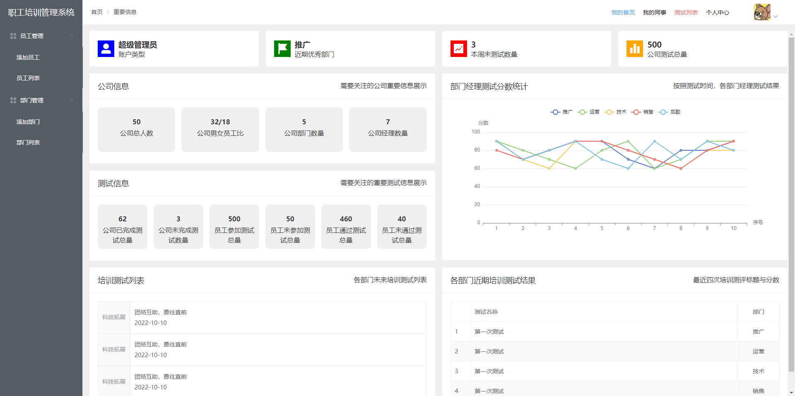

# Vue 第十六天

## 一、 Vue项目

### 1.1 企业项目开发

项目立项：MRD，敏捷开发工具

项目排期：设计图，接口文档

项目开发

项目提交

项目测试

项目上线

后期跟进

### 1.2 项目介绍

我们基于vue cli和element-ui实现pc端的后台管理系统。

技术架构

 	我们使用了vue, vue-cli, webpack, vuex, vue-router, elemnet-ui, axios, ES6, ES Module, sass, token登录，权限管理等技术实现一个pc端的后台管理系统单页面应用。

### 1.3 项目部署

项目主要包含两个部分：后台管理系统项目，服务器端项目，所以分别用两个文件夹表示：

​	 home  后台管理系统项目（基于vue cli项目开发）

​	 server  服务器与数据库

 在home目录下开发项目，发布到server服务端预览效果

### 1.4 搭建服务器

我们通过express搭建一个服务器：

​		 1 为了预览移动端和后台管理系统发布效果

​		 2 为了实现一些mock数据

服务器端实现的功能：实现资源静态化，路由，服务器，mock数据

​		 将静态资源发布到server/static目录下。

​		 将模板资源发布到server/views/index.html文件中。

端口号

​		 3010和3011  表示服务器端

​		 8080 表示移动端

​																																									2023-03-03